# Tugas 1 IF3110 Pengembangan Aplikasi Berbasis Web

## Deskripsi Aplikasi Web
Aplikasi website digunakan sebagai website untuk menjual coklat. Pada aplikasi web ini, terdapat 2 jenis pengguna, yaitu superuser dan user. Kedua pengguna dapat melakukan akun, login, logout, pencarian produk, dan mendapatkan penjelasan produk secara detail. User dapat melakukan pembelian produk dan melihat riwayat pembelian produk. Superuser adalah admin yang dapat menambah jenis coklat baru yang ingin dijual dan menambah ketersediaan coklat, serta mengakses apa yang bisa diakses oleh user. Untuk seorang pengguna yang belum melakukan login, pengguna hanya dapat menampilkan halaman login & register, namun bisa menampilkan penjelasan produk secara langsung melalui backend (namun tidak dapat mengubah data).

Aplikasi website ini berjalan di atas PHP, bersamaan dengan penggunaan HTML, JS, dan CSS, dan tersedia dengan tampilan komputer/laptop dan mobile.

## Requirements
-

## Installation
### MySQL
#### Linux/Ubuntu
- Install MySQL dengan menjalankan `sudo apt install mysql-server` pada terminal
- Lakukan konfigurasi mysql dengan menjalankan `sudo mysql_secure_installation` pada terminal
- Masukkan password baru untuk user `root`
- Jalankan mysql dengan perintah `mysql -u root -p`
- Masukkan password untuk user `root`
- Buatlah user baru dengan menjalankan query `CREATE USER 'username'@'localhost' IDENTIFIED WITH authentication_plugin BY 'password';` dengan mengubah username dengan username anda dan password dengan password tertentu
- Jalankan query `GRANT ALL PRIVILEGES ON * . * TO 'username'@'localhost';` dengan mengubah username dengan username sebelumnya
#### Windows
- Install MySQL dari https://dev.mysql.com/downloads/windows/installer/8.0.html
- Lakukan konfigurasi mysql dengan menjalankan installer tersebut
- Masukkan password baru untuk user `root`
- Jalankan mysql dengan perintah `mysql -u root -p`
- Masukkan password untuk user `root`
- Buatlah user baru dengan menjalankan query `CREATE USER 'username'@'localhost' IDENTIFIED WITH authentication_plugin BY 'password';` dengan mengubah username dengan username anda dan password dengan password tertentu
- Jalankan query `GRANT ALL PRIVILEGES ON * . * TO 'username'@'localhost';` dengan mengubah username dengan username sebelumnya

### Setup Enviroment Variables
- Buatlah file `env.php` pada folder `src/bootstrap` dengan mengikuti format pada `env.example.php`
- Ubahlah `mysql_database_name` dengan nama tertentu, `mysql_username` dengan username user yang dibuat, dan `mysql_password` dengan password user yang dibuat

### Setup Database
Jalankan file `src/database/migrations/driver.php` melalui XAMPP atau dengan menjalankan `php src/database/migrations/driver.php`.

## How To Run
### PHP Server
Jalankan perintah `php -S 0.0.0.0:5000 -t src/public/` pada folder root git ini.

## Daftar Halaman

### Login Page

### Register Page

### Dashboard page

### Search Result page

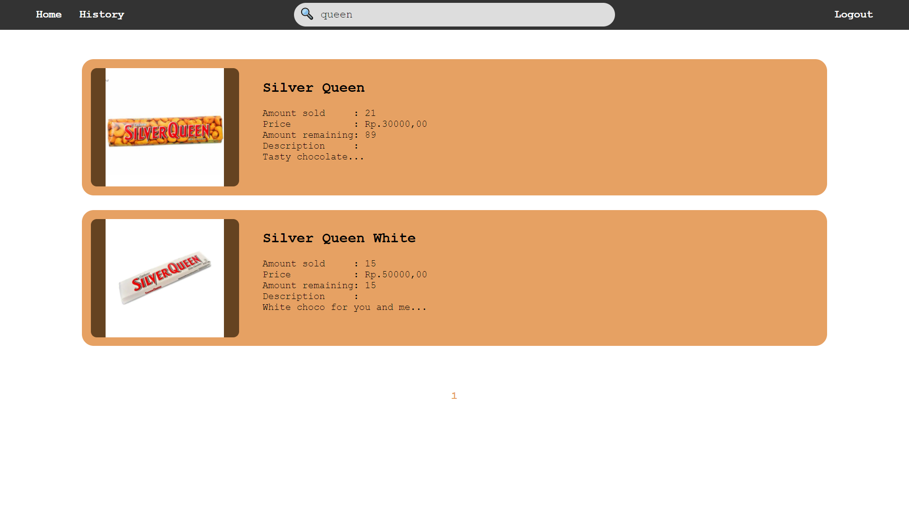
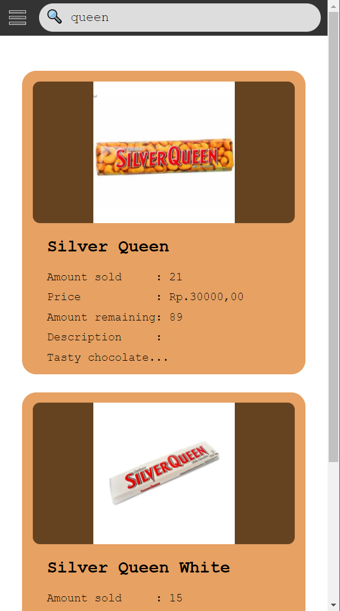
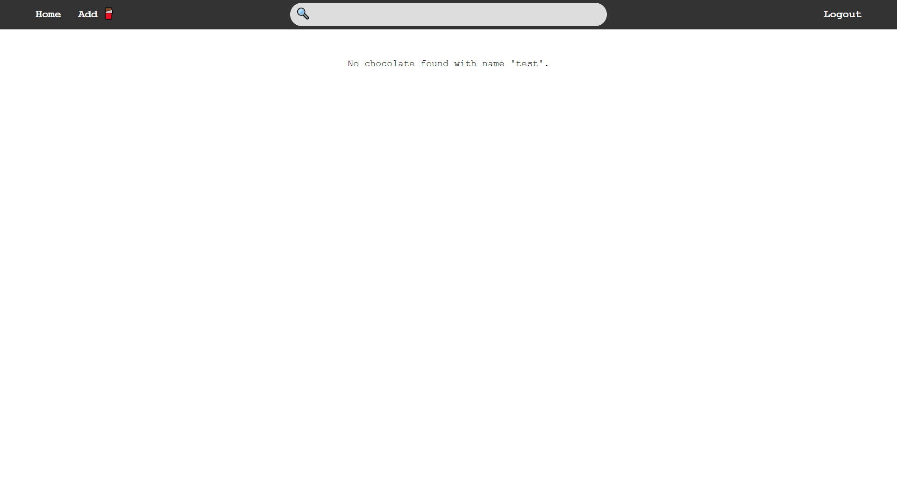
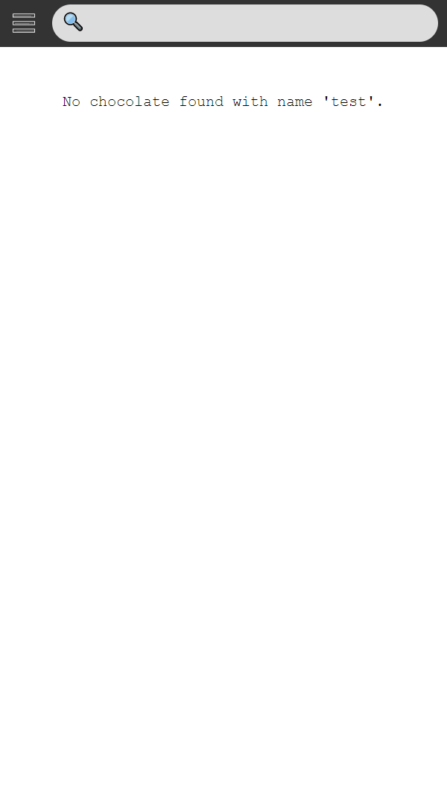

### Chocolate Detail page

#### Chocolate Detail - User

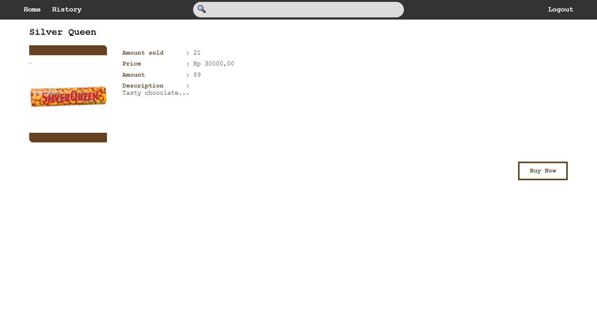


#### Chocolate Detail - Buy Chocolate

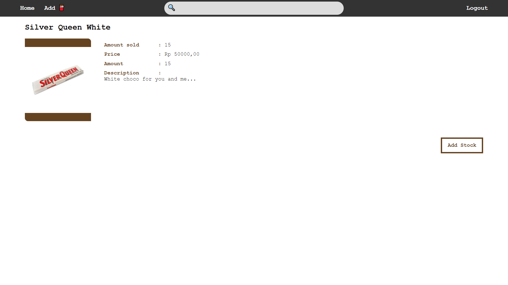
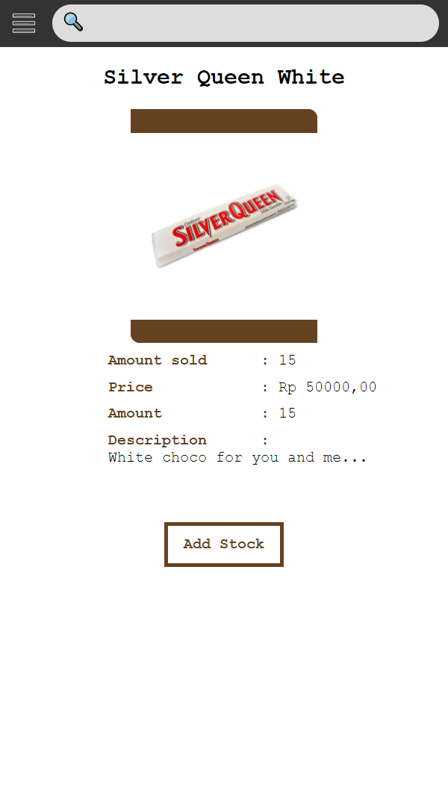

#### Chocolate Detail - Superuser

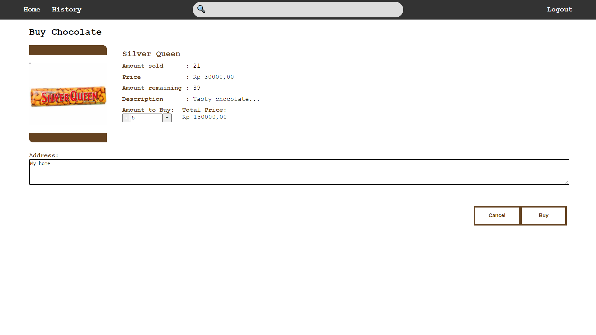
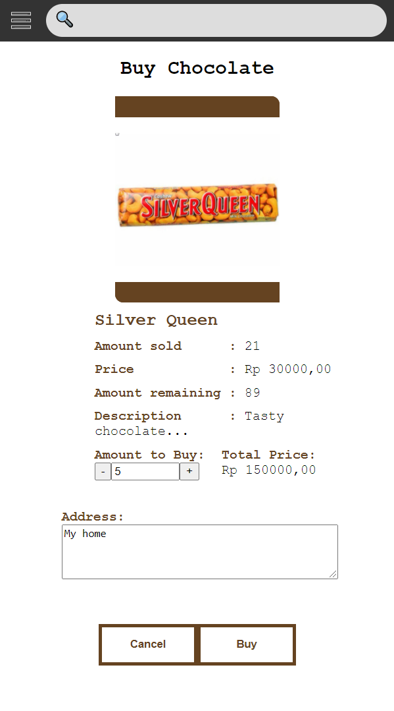

#### Chocolate Detail - Add Stock

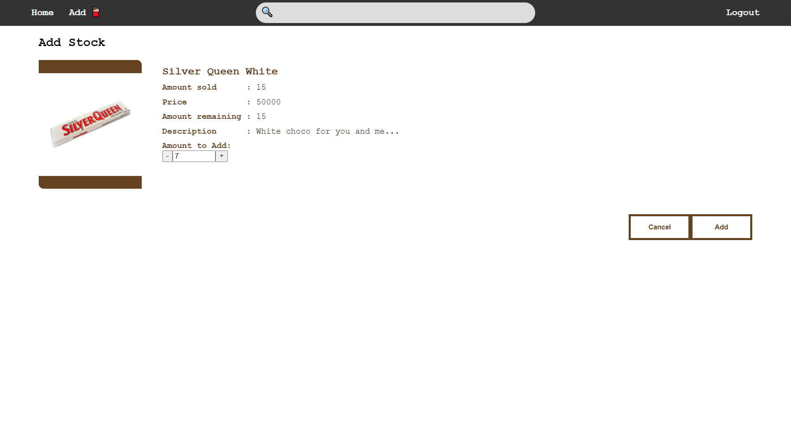
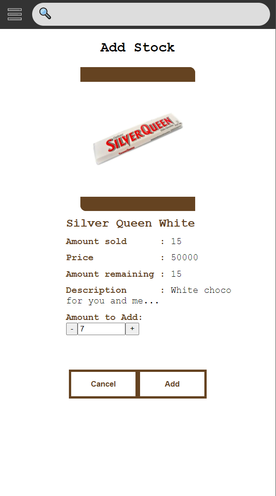

### Transaction History Page
1. Halaman Transaction History<br>
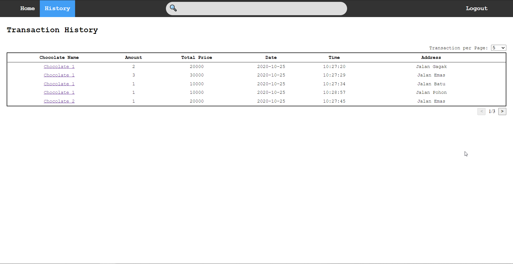<br>
2. Halaman Transaction History dengan pengaturan transaksi per halaman yang berbeda<br>
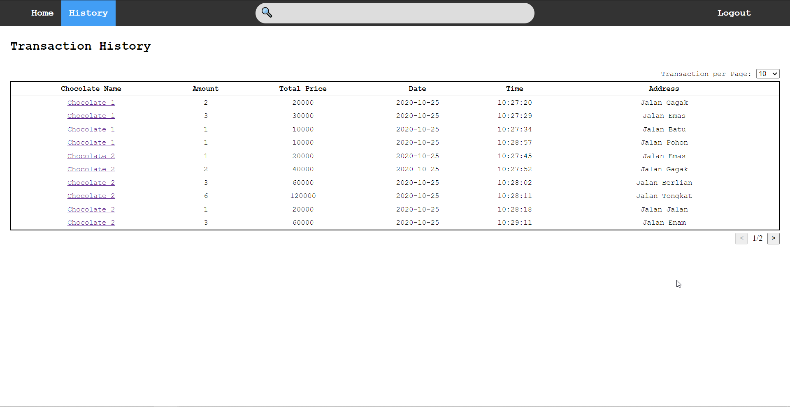<br>
3. Halaman Transaction History di perangkat dengan layar kecil<br>
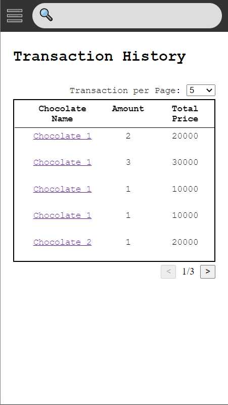
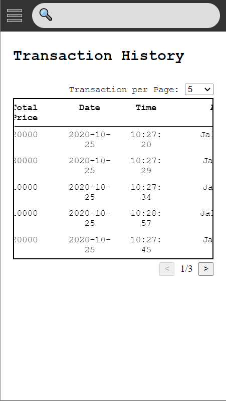
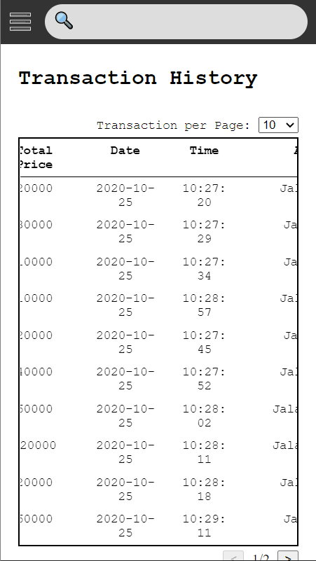<br>

### Add New Chocolate Page

1. Halaman Add New Chocolate<br>
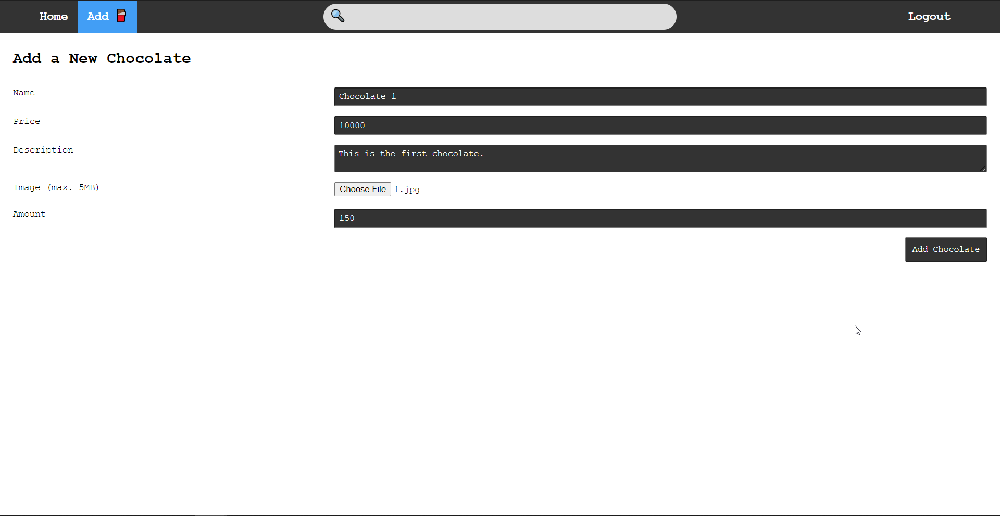<br>
2. Halaman Add New Chocolate setelah menekan tombol Add Chocolate<br>
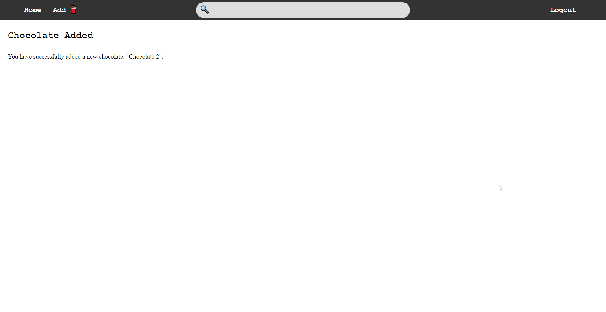<br>
3. Halaman Add New Chocolate di perangkat dengan layar kecil<br>
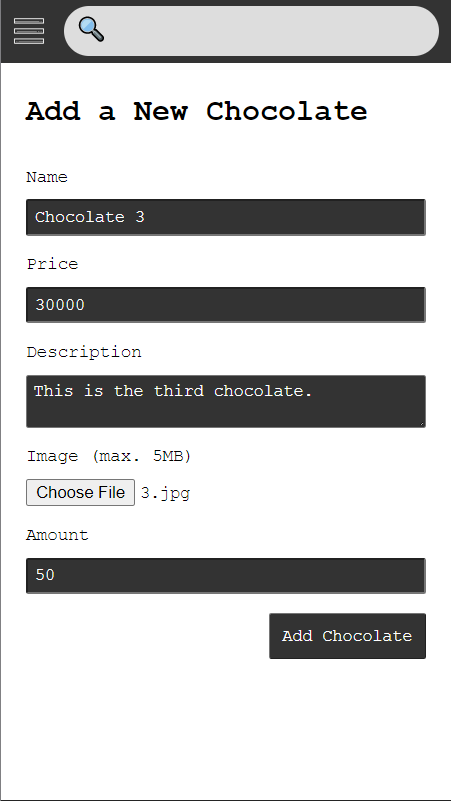
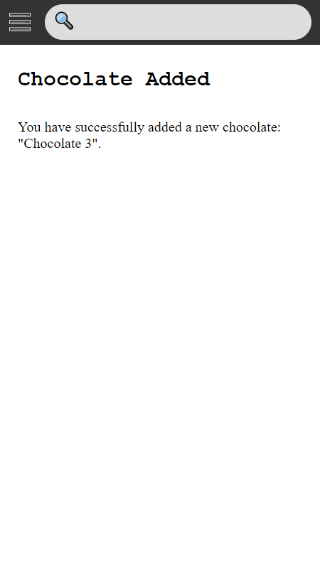<br>

### Access Token Expiry Time

### Real-Time Stock Update

### Responsive View

## Daftar Requirement

## Instalasi

## Cara Menjalankan

### Memakai php built in server:
1. Jalankan command `php -S localhost:<port> -t <path/to/folder/public>` di cmd atau terminal. Sebagai contoh jika menggunakan port 8080 dan sekarang cmd atau terminal berada di folder src repository ini, commandnya adalah `php -S localhost:8080 -t public`.
2. Buka alamat `localhost:8080` di browser.
3. Website siap digunakan.

### Memakai XAMPP:
1. Buka file config `httpd.conf`.
2. Ubah path pada DocumentRoot menjadi `path/to/folder/public` (untuk set root folder).
3. Ubah path pada tag Directory menjadi `path/to/repository-folder` (untuk memberi akses ke file-file yang dibutuhkan).
4. Berikut adalah contoh `httpd.conf` bagian DocumentRoot dan tag Directory yang merupakan hasil pengubahan dari config bawaan XAMPP.
```
...
DocumentRoot "E:/KULIAH/SEMESTER 5/Pengembangan Aplikasi Berbasis Web/Tubes/1/tugas-besar-1-2020/src/public"
<Directory "E:/KULIAH/SEMESTER 5/Pengembangan Aplikasi Berbasis Web/Tubes/1/tugas-besar-1-2020/">
    #
    # Possible values for the Options directive are "None", "All",
    # or any combination of:
    #   Indexes Includes FollowSymLinks SymLinksifOwnerMatch ExecCGI MultiViews
    #
    # Note that "MultiViews" must be named *explicitly* --- "Options All"
    # doesn't give it to you.
    #
    # The Options directive is both complicated and important.  Please see
    # http://httpd.apache.org/docs/2.4/mod/core.html#options
    # for more information.
    #
    Options Indexes FollowSymLinks Includes ExecCGI

    #
    # AllowOverride controls what directives may be placed in .htaccess files.
    # It can be "All", "None", or any combination of the keywords:
    #   AllowOverride FileInfo AuthConfig Limit
    #
    AllowOverride All

    #
    # Controls who can get stuff from this server.
    #
    Require all granted
</Directory>
...
```
5. Jalankan Apache server dari Control Panel XAMPP.
6. Buka alamat `localhost` di browser. Atau `localhost:<port>` jika port default Apache server dari XAMPP telah diubah.
7. Website siap digunakan.

## Screenshots

## Anggota Kelompok

1. Yonatan Viody (13518148)
2. Naufal Dean Anugrah (13518123)
3. Muhammad Rizky Ismail Faizal (13518148)

## Pembagian Tugas

### Frontend
1. Login: 13518120
2. Register: 13518120
3. Dashboard: 13518120
4. Search Result: 13518123
5. Chocolate Detail: 13518123
6. Transaction History: 13518148
7. Add New Chocolate: 13518148
8. Access Token Expiration (bonus): 13518120
9. Real-Time Stock Update (bonus): 13518123
10. Responsive View (bonus): 13518120, 13518123, 13518148

### Backend
1. Login: 13518120
2. Register: 13518120
3. Dashboard: 13518120
4. Search Result: 13518123
5. Chocolate Detail: 13518123
6. Transaction History: 13518148
7. Add New Chocolate: 13518148
8. Access Token Expiration (bonus): 13518120
9. Real-Time Stock Update (bonus): 13518123
10. Responsive View (bonus): 13518120, 13518123, 13518148
